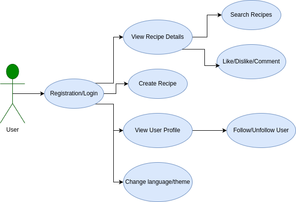
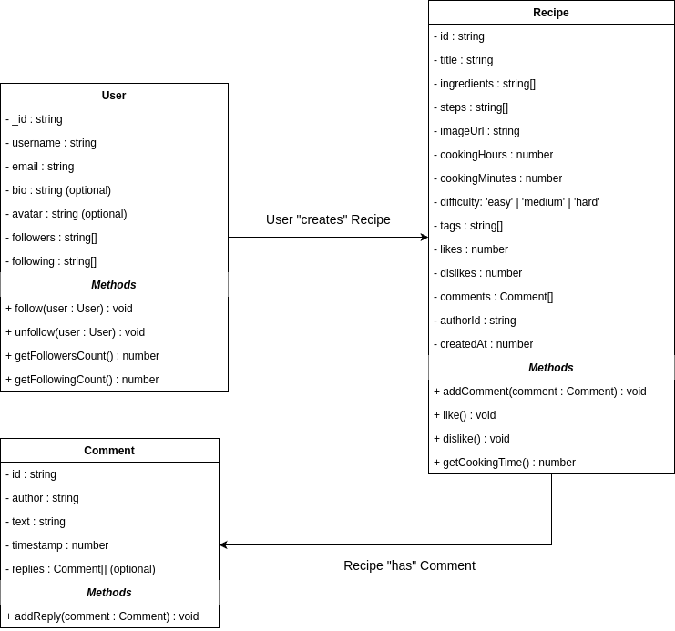

# Cook Hub 🍳

**Cook Hub**, yemek tutkunları için tasarlanmış tam teşekküllü bir sosyal ağdır. Kullanıcılar tarifleri malzeme veya isimle arayabilir, kendi tariflerini oluşturup paylaşabilir, diğer aşçıları takip edebilir, tarifleri beğenebilir/beğenmeyebilir, yorum bırakabilir ve kişiselleştirilmiş bir akışın keyfini çıkarabilir.

Uygulama **4 dil** destekler (Türkçe, İngilizce, Rusça, Kazakça), **açık ve koyu tema** seçenekleri sunar ve modern teknolojilerle oluşturulmuş temiz, duyarlı bir tasarıma sahiptir.

## ✨ Özellikler

### Uygulanan Özellikler
- Kullanıcı kayıt ve giriş sistemi (JWT + cookies)
- Tarif arama (başlık ve malzeme bazlı)
- Kişiselleştirilmiş akış (Takip edilenler + Genel Akış)
- Tarif detay sayfası (fotoğraf, malzemeler, adım adım talimatlar, etiketler, pişirme süresi, zorluk derecesi)
- Kendi tariflerini oluşturma ve yayınlama
- Beğeni / Beğenmeme
- Tariflere yorum yapma
- Yazarları takip etme / takipten çıkma
- Kullanıcı profil sayfası
- Çok dilli destek (i18next) — 4 dil
- Açık / koyu tema geçişi
- Tamamen duyarlı (mobil uyumlu) tasarım

### Planlanan Özellikler
- Favorilere ekleme
- Bildirimler
- Gelişmiş filtreler (diyet, kalori, hazırlama süresi)
- Yazar puanlaması

## 🛠 Teknoloji Yığını

### Frontend
- React 19 + TypeScript
- Create React App
- Tailwind CSS (stil)
- i18next (çok dilli destek)
- Axios (API istekleri)
- Lucide React (ikonlar)

### Backend
- Node.js + Express
- MongoDB + Mongoose
- JWT tabanlı kimlik doğrulama
- Bcrypt (şifre hashleme)
- Nodemailer (e-posta doğrulama)
- Cookie-parser, CORS, dotenv

## 📋 Gereksinim Analizi (Analiz Modeli)

### Hedef Kitle
- Yemek pişirmeyi seven herkes
- Evde yemek yapan ev hanımları / beyleri
- Tek başına yaşayan öğrenciler (hızlı ve kolay tarifler arayanlar)
- Malzemesi olan ama ne yapacağını bilemeyen kişiler

### Fonksiyonel Gereksinimler
Sistem şunları yapabilmelidir:
- Kullanıcı kayıt, giriş ve e-posta doğrulaması
- Tarif arama (başlık ve malzeme bazlı)
- Tarif oluşturma, düzenleme ve yayınlama
- Tariflere beğeni/beğenmeme ve yorum yapma
- Diğer kullanıcıları takip etme
- Kişiselleştirilmiş akış gösterme
- Profil yönetimi
- 4 dil desteği ve tema seçimi

### Fonksiyonel Olmayan Gereksinimler
- Güvenlik: Şifre hashleme, JWT token, korumalı route'lar
- Performans: Hızlı arama ve yükleme
- Erişilebilirlik: Mobil uyumlu tasarım
- Kullanılabilirlik: Sezgisel arayüz, çok dilli destek
- Güvenilirlik: Veri kaybını önlemek için MongoDB ve localStorage kullanımı

## 🎨 Tasarım Modeli (Tasarım Modeli)

### Sistem Mimarisi
Proje istemci-sunucu mimarisine sahiptir:

### Diyagramlar

## 📋 Gereksinim Analizi ve Tasarım Modelleri

### Analiz Modeli
- **Hedef Kitle:** Yemek pişirmeyi seven öğrenciler, ev hanımları ve malzeme bazlı tarif arayan herkes.
- **Fonksiyonel Gereksinimler:** Kayıt/giriş, tarif arama/oluşturma, beğeni/yorum, takip sistemi, profil yönetimi, çok dilli destek.
- **Fonksiyonel Olmayan Gereksinimler:** Güvenlik (JWT, bcrypt), performans, mobil uyumluluk, tema seçeneği.

### Tasarım Modeli

#### Use Case Diyagramı
Kullanıcıların sistemle etkileşimini gösterir.

#### Class Diyagramı
Veritabanı modellerini (User, Recipe, Comment) ve ilişkileri gösterir.

Adilet Karzhanov ve Farid Maksumov